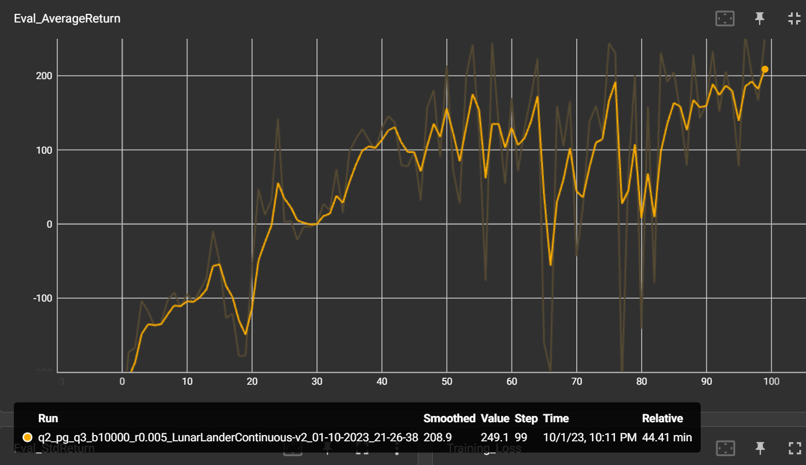

# expt 1 small batch: 
Originally, I ran the first 3 with averaging over transitions. 

but this is not right as the average is over trajectories, so i made some adjustments so that N can be obtained during the update step. also in 2023 ver, they switched to averaging over trajectories. From here on, my expts use averaging over N

a bit of brittle behavior for RTG DSA at the end

# expt 1 larger batch: 

## Which value estimator has better performance without advantage-standardization: the trajectory centric one, or the one using reward-to-go?

RTG

## Did advantage standardization help?
Not much diff for this case

## Did the batch size make an impact?
yes, training is a lot more stable and converges to max faster

# expt 2:

python cs285/scripts/run_hw2.py --env_name InvertedPendulum-v4 --ep_len 1000 --discount 0.9 -n 100 -l 2 -s 64 -b 5000 -rtg --exp_name q2_b5000_r_default

cant be bothered to tune params. achieves max score after 60 iters, but brittle behavior afterwards

# expt 3:
used batch of 10000 due to limited VRAM. still managed to hit 180 reward at the end

# expt4:
## param search
- started of with batch 10k as it is the lowest, LR 0.02 as highest. rewards taper around 60 iters at 100
- batch 10k, LR 0.01. rewards kept increasing throughout, till 50
- batch 30k, LR 0.01. rewards kept increasing throughout at a faster pace than batch 10k LR 0.01, but i stopped it at iter 80 as the avg return was 60 and doesnt seem to hit 200 by iter 100
- best among LR 0.02 is batch 50k

## ablation

# expt 5

used lambda 0.95 to reach 400 return around step 231 but rewards dropped after

strangely GAE doesnt help (lambda=1 performs better)