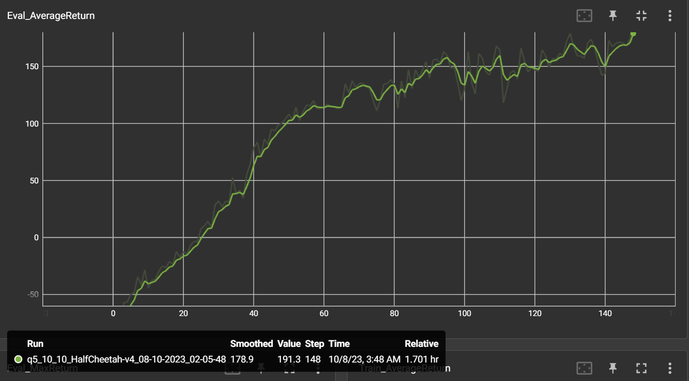

# Question 1: basic Q-learning performance (DQN): 
stopped early at 1m steps, managed to reach 1.5k reward

# Question 2: double Q-learning (DDQN).
we can see a slight advantage in DDQN over DQN

# Question 3: experimenting with hyperparameters.
skip

# Question 4: Sanity check with Cartpole
seems like 10, 10 is the best setting

# Question 5: Run soft actor-critic with more difficult tasks
Note: using v4 instead of v2 due to dependencies issues

# Question 6: Run soft actor-critic more difficult tasks.
early stop as the eval rewards reached the intended scores

