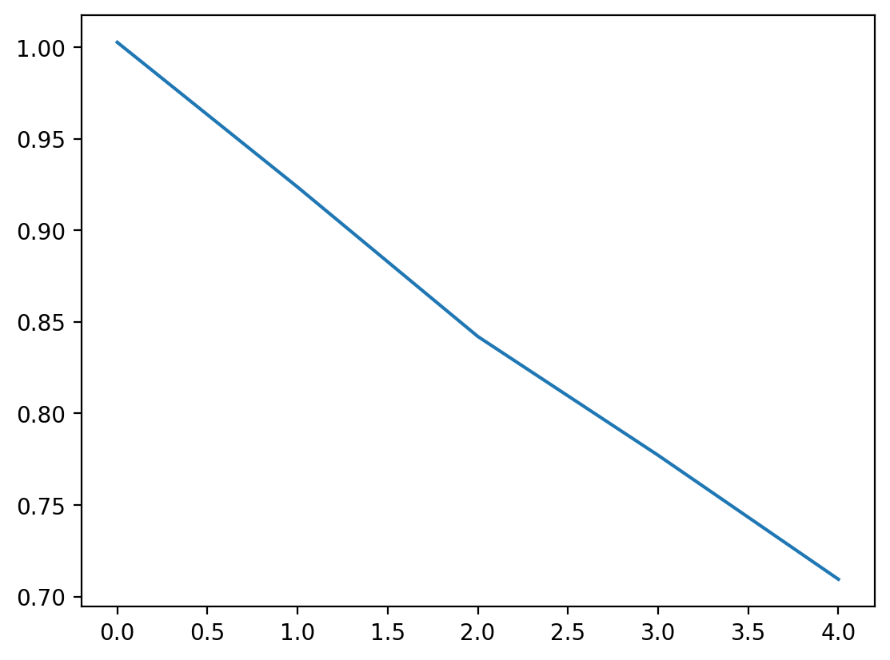

# Problem 1: Train dynamics model

## n5_arch2x250

## n500_arch2x250

## n500_arch1x32

## Discussion
The one with the larger num of train steps per iter and larger NN size performs the best. 

# Problem 2: Action selection using learned dynamics model and a given reward function

# Problem 3: MBRL algorithm with on-policy data collection and iterative model training.

early stop cheetah as reward reached

# Problem 4: MBRL Ablation studies
## Horizon

Longer horizon seems to lead to poorer result. Doesnt seem intuitive, not v confident on this

## Numseq

Higher numseq leads to higher performance, makes sense

## Ensemble

Larger ensemble leads to higher performance, makes sense

# Problem 5: Comparison against CEM

how does CEM affects

results for different numbers of sampling iterations (2 vs. 4).

# Problem 6: MBPO + SAC

TODO